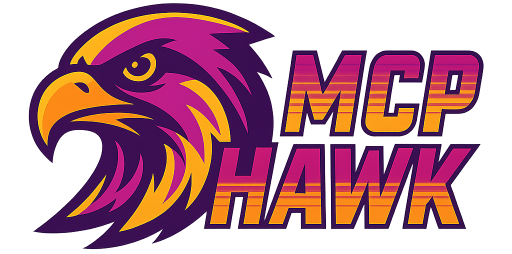

<div align="center">
  
  
  [](https://github.com/tech4242/mcphawk/actions/workflows/ci.yml)
  [](https://codecov.io/gh/tech4242/mcphawk)
  [](https://www.python.org/downloads/)
  [](https://fastapi.tiangolo.com/)
  [](https://vuejs.org/)
  [](https://github.com/astral-sh/ruff)
  [](https://www.python.org/dev/peps/pep-0008/)
  [](https://opensource.org/licenses/MIT)
</div>

MCPHawk is a passive sniffer for **Model Context Protocol (MCP)** traffic, similar to Wireshark but MCP-focused.

It captures JSON-RPC traffic between MCP clients and WebSocket/TCP-based MCP servers (IPv4 and IPv6). MCPHawk can reconstruct full JSON-RPC messages from raw TCP traffic without requiring a handshake.

## What it is
Passive network sniffer for MCP/JSON-RPC traffic (like Wireshark, but protocol-focused).
Captures traffic "on the wire" between any MCP client and server—does not require client/server modification.
Records real traffic (from any tool, agent, or LLM) as it actually flows over TCP/WebSocket.
Web dashboard for live and historical log viewing with proper JSON-RPC message type detection.
CLI for running as a standalone process or with web UI.
No proxying or protocol injection—just observes real traffic.

## Features

- **Proper JSON-RPC 2.0 message type detection**:
  - Requests (method + id)
  - Responses (result/error + id)
  - Notifications (method without id)
  - Error responses
- **Auto-detect mode** - automatically discovers MCP traffic on any port without prior configuration
- **Flexible traffic filtering**:
  - Monitor specific ports with `--port`
  - Use custom BPF filters with `--filter`
  - Auto-detect MCP traffic on all ports with `--auto-detect`
- **Chronological message display** - messages shown in order as captured
- **Message filtering** - view all, requests only, responses only, or notifications only
- **Optional ID-based pairing visualization** - see which requests and responses belong together
- **Real-time statistics** - message counts by type
- **Console-only mode** - use `mcphawk sniff` for terminal output without web UI
- **Historical log viewing** - use `mcphawk web --no-sniffer` to view past captures without active sniffing

## mcpinspector vs. MCPHawk

If you want to observe all MCP traffic between any processes, MCPHawk offers unique value as a passive sniffer that mcpinspector does not. If you want to actively test servers, mcpinspector is better. For many workflows, they are complementary tools.

| Feature                                      | MCPHawk | mcpinspector |
|-----------------------------------------------|:---------:|:------------:|
| Passive sniffing (no proxy needed)            |     ✅     |      ❌       |
| Auto-detect MCP traffic on any port           |     ✅     |      ❌       |
| Web UI for live/historical traffic            |     ✅     |      ✅       |
| Can capture any traffic (not just via proxy)  |     ✅     |      ❌       |
| JSON-RPC message type detection               |     ✅     |      ❌       |
| Message filtering by type                     |     ✅     |      ❌       |
| Console-only mode (no web UI needed)          |     ✅     |      ❌       |
| Manual request crafting/testing               |     ❌     |      ✅       |
| Interactive tool/prompt testing               |     ❌     |      ✅       |
| Proxy/bridge between client/server            |     ❌     |      ✅       |
| No client/server config changes required      |     ✅     |      ❌       |

## Installation

### For Users

```bash
# Install from PyPI (when published)
pip install mcphawk

# Or install directly from GitHub
pip install git+https://github.com/tech4242/mcphawk.git
```

### For Developers

```bash
# Clone the repository
git clone https://github.com/tech4242/mcphawk.git
cd mcphawk

# Set up Python environment
python3 -m venv .venv
source .venv/bin/activate  # On Windows: .venv\Scripts\activate

# Install backend dependencies
pip install -r requirements-dev.txt
pip install -e .

# Install frontend dependencies and build
cd frontend
npm install
npm run build
cd ..

# Run tests
python -m pytest -v
```

## Usage

### Quick Start

```bash
# Get help
mcphawk --help

# Get help for specific command
mcphawk sniff --help
mcphawk web --help

# Start web UI with auto-detect mode
mcphawk web --auto-detect

# Monitor MCP traffic on a specific port (console output)
mcphawk sniff --port 3000

# Monitor multiple ports with a custom filter
mcphawk sniff --filter "tcp port 3000 or tcp port 8080"

# Auto-detect MCP traffic on any port
mcphawk sniff --auto-detect

# Start web UI with sniffer on specific port
mcphawk web --port 3000

# Start web UI with custom filter for multiple ports
mcphawk web --filter "tcp port 3000 or tcp port 8080"

# View historical logs only (no active sniffing)
mcphawk web --no-sniffer

# Custom web server configuration
mcphawk web --port 3000 --host 0.0.0.0 --web-port 9000

# Enable debug output for troubleshooting
mcphawk sniff --port 3000 --debug
mcphawk web --port 3000 --debug
```

### CLI Options

#### Common Options (both commands)
- `--port` / `-p`: TCP port to monitor
- `--filter` / `-f`: Custom BPF filter expression
- `--auto-detect` / `-a`: Auto-detect MCP traffic on any port
- `--debug` / `-d`: Enable debug output for troubleshooting

#### Web Command Only
- `--no-sniffer`: Disable sniffer (view historical logs only)
- `--host`: Web server host (default: 127.0.0.1)
- `--web-port`: Web server port (default: 8000)

### Development Mode

```bash
# Option 1: Use make (recommended)
make dev  # Runs both frontend and backend

# Option 2: Run separately
# Terminal 1 - Frontend with hot reload
cd frontend && npm run dev

# Terminal 2 - Backend
mcphawk web --port 3000

# Option 3: Watch mode
cd frontend && npm run build:watch  # Auto-rebuild on changes
mcphawk web --port 3000           # In another terminal
```

### Testing with Dummy Server

```bash
# Run dummy MCP server for testing
python3 dummy_mcp_server.py

# Send test MCP call
(echo -n '{"jsonrpc":"2.0","method":"ping"}'; sleep 1) | nc 127.0.0.1 12345

# Generate various MCP patterns
python3 test_mcp_patterns.py
```

## Potential Upcoming Features

Vote for features by opening a GitHub issue!

- [x] **Auto-detect MCP traffic** - Automatically discover MCP traffic on any port without prior configuration
- [ ] **Protocol Version Detection** - Identify and display MCP protocol version from captured traffic
- [ ] **Smart Search & Filtering** - Search by method name, params, or any JSON field with regex support
- [ ] **Performance Analytics** - Request/response timing, method frequency charts, and latency distribution
- [ ] **Export & Share** - Export sessions as JSON/CSV, generate shareable links, create HAR-like files
- [ ] **Test Generation** - Auto-generate test cases from captured traffic
- [ ] **Error Analysis** - Highlight errors, group similar issues, show error trends
- [ ] **Session Management** - Save/load capture sessions, compare sessions side-by-side
- [ ] **Interactive Replay** - Click any request to re-send it, edit and replay captured messages
- [ ] **Real-time Alerts** - Alert on specific methods or error patterns with webhook support
- [ ] **Visualization** - Sequence diagrams, resource heat maps, method dependency graphs
- [ ] **MCP Server Interface** - Expose captured traffic via MCP server for AI agents to query and analyze traffic patterns