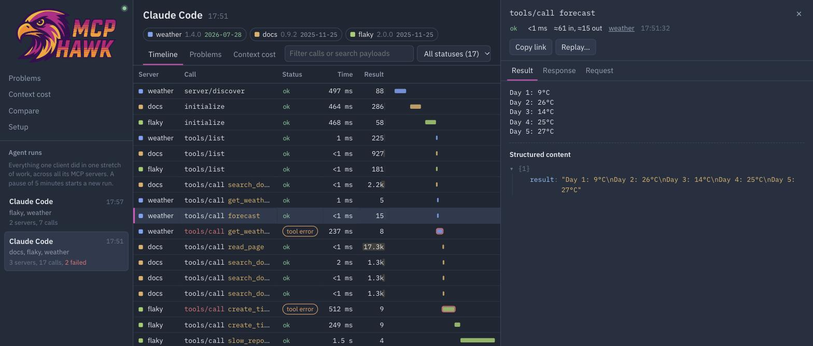
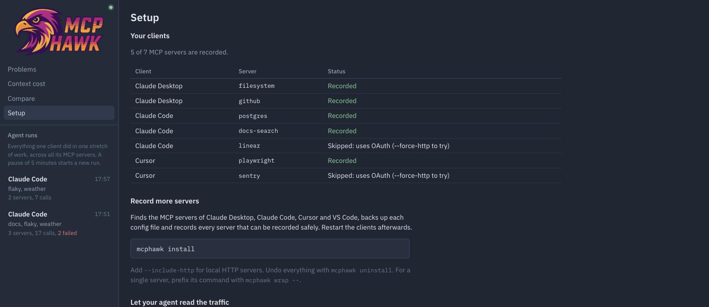
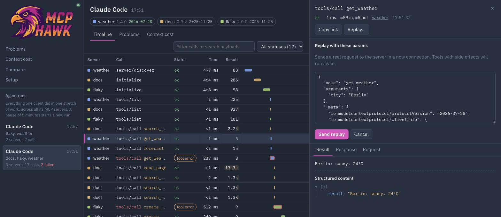
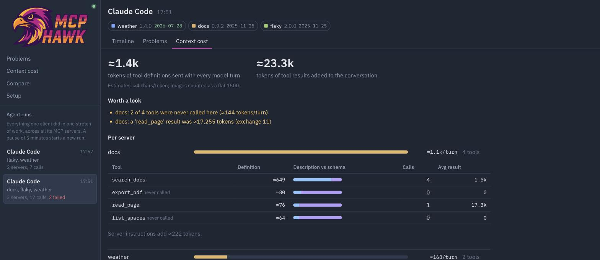
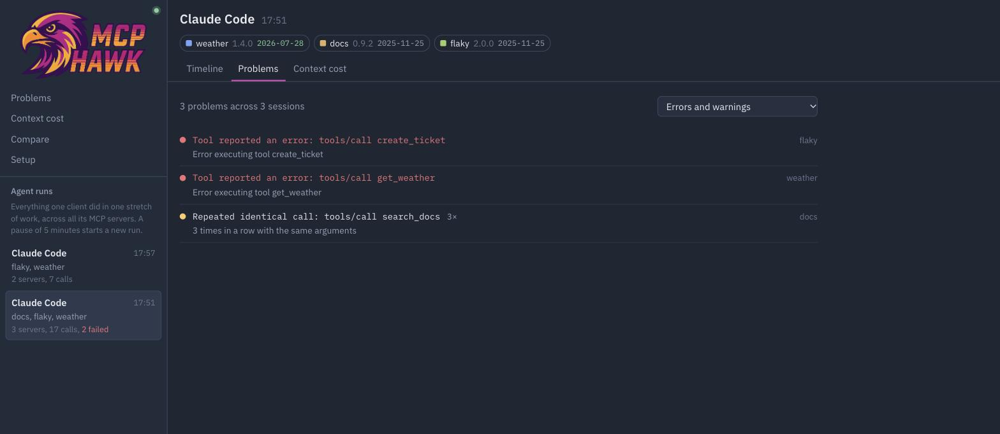

<div align="center">
  

  [](https://github.com/tech4242/mcphawk/actions/workflows/ci.yml)
  [](https://codecov.io/gh/tech4242/mcphawk)
  [](https://pypi.org/project/mcphawk/)
  [](https://www.python.org/downloads/)
  [](https://modelcontextprotocol.io/specification/2026-07-28)
  [](https://opensource.org/licenses/MIT)
</div>

**MCPHawk is DevTools for the Model Context Protocol.** It records the real traffic
between your MCP clients (Claude Code, Claude Desktop, Cursor, VS Code, your own agent)
and their servers, and shows it the way a browser's network tab would: every call your
agent made, in order, across all its servers, with what it cost and what went wrong.

The same data is available to your agent: add MCPHawk as an MCP server and Claude Code can
find the failing call, read it, fix your server and check again, linking you to exactly
what it looked at.



## Get started in a minute

```bash
pip install mcphawk          # or prefix the commands below with `uvx`
mcphawk install              # route your clients' MCP servers through MCPHawk
                             # ...restart your MCP clients and use them as usual...
mcphawk up --open            # open the UI at http://127.0.0.1:8484
```

`mcphawk install` finds the MCP servers of Claude Desktop, Claude Code, Cursor and VS Code,
backs up each config file, and puts MCPHawk in front of every server it can record without
getting in the way:

```text
claude-desktop (user)  ~/Library/Application Support/Claude/claude_desktop_config.json
  + filesystem               recorded (stdio wrapper)
  + github                   recorded (stdio wrapper)

claude-code (user)  ~/.claude.json
  + postgres                 recorded (stdio wrapper)
  + docs-search              recorded (HTTP proxy)
    linear                   skipped: remote server without static headers, probably OAuth (--force-http)

cursor (user)  ~/.cursor/mcp.json
  + playwright               recorded (stdio wrapper)
    sentry                   skipped: remote server without static headers, probably OAuth (--force-http)

5 server(s) will be recorded, 2 skipped. Continue? [Y/n]:
```

Nothing else about your servers changes, and `mcphawk uninstall` puts every entry back.
The **Setup** page shows the same picture at any time:



Let your agent read the traffic too:

```bash
claude mcp add mcphawk -- mcphawk mcp
```

No client handy? `make demo` drives three real MCP servers so the UI has something to show.

## Agent runs

Everything in MCPHawk is organised around **agent runs**. A run is everything one client
did in one stretch of work, across all of its MCP servers: ask Claude Code to fix a flaky
test and the filesystem reads, the GitHub calls and the ticket it files all land on one
timeline, in the order they happened.

* **One client, all its servers.** stdio servers are tied to the client process that
  started them; HTTP servers join when they report the same client name at the same time.
* **Split by pauses.** Five minutes without a single call ends the run, so a Claude Code
  window that stays open all day becomes one run per task, not one endless log.
* **Links stay valid.** A run keeps its address as more traffic arrives, so you can paste
  it into an issue or let the agent hand it to you.

Sessions (one client talking to one server) are still there underneath: click a server
name above the timeline to see just that connection.

## What you can do with it

### See what the agent actually did

The timeline shows every call of a run as a waterfall: which server, which tool, how long
it took, how big the result was, and whether it failed. Filter by status, or search inside
request and response payloads. Multi round-trip requests from the 2026-07-28 spec (the
server asks for input, the client retries) are shown as one chain.

### Inspect a single call

Click any call for its details: the tool result rendered the way the model received it
(text, images, embedded resources), the full request and response, HTTP headers, and a
link you can share. **Replay** sends the same request again, optionally with edited
arguments, and records the replay next to the original so you can compare.



### Find out what your servers cost in context

Every tool definition is sent to the model on every turn, whether the tool is used or not.
**Context cost** estimates the tokens each server and each tool adds per turn, splits
descriptions from schemas, marks tools that were never called, and lists the results that
blew up the conversation.



### Know what went wrong, first

**Problems** collects everything worth a look, most severe first: JSON-RPC errors, tool
errors, calls that never got an answer, slow calls, agents repeating the same call, and spec
violations for the protocol version each session negotiated (missing `resultType` or cache
hints, missing `Mcp-Method` headers, stray output on stdout, deprecated features).



### Catch regressions between versions

**Compare** puts two sessions of a server side by side: tools added, removed or changed
(with the change in tokens per turn) and how each call's count, errors and latency moved.

### Send it to Grafana, Datadog or any OpenTelemetry backend

MCPHawk streams what it records as OpenTelemetry **metrics, logs and traces** over OTLP,
using the [OpenTelemetry conventions for MCP](https://github.com/open-telemetry/semantic-conventions-genai/blob/main/docs/gen-ai/mcp.md),
so MCP traffic shows up next to everything else you monitor. It works for every server
MCPHawk records, including ones that have no instrumentation of their own.

Try it locally with Grafana's all-in-one OpenTelemetry image:

```bash
docker run -p 3000:3000 -p 4318:4318 grafana/otel-lgtm
pip install 'mcphawk[otel]'
OTEL_EXPORTER_OTLP_ENDPOINT=http://localhost:4318 mcphawk up --otlp
```

Then import [`examples/grafana/mcphawk-dashboard.json`](examples/grafana/mcphawk-dashboard.json)
in Grafana (http://localhost:3000): requests, failures, error rate, p95 latency per tool,
the failing tools, and what each server's tool definitions cost per turn.

| Signal | What is sent |
|---|---|
| Metrics | `mcp.client.operation.duration` (request count, failures by `error.type`, latency), `mcphawk.tool.result.tokens`, `mcphawk.tool.definition.tokens` |
| Logs | One record per MCP message: method, direction, tool, ids, errors. Payloads only with `--otlp-payloads` (masked, capped) |
| Traces | One span per call. It joins the agent's own trace when the client sends a `traceparent`; otherwise each agent run is one trace. Every span links back into the MCPHawk UI |

Configuration uses the standard OpenTelemetry variables (`OTEL_EXPORTER_OTLP_ENDPOINT`,
`OTEL_EXPORTER_OTLP_HEADERS`, `OTEL_SERVICE_NAME`, ...), so any OTLP backend works, for
example the Datadog Agent's OTLP receiver. Already run Prometheus? `mcphawk up` also
serves the same metrics at `http://127.0.0.1:8484/metrics` for scraping, and the dashboard
works with either. To send past traffic, run `mcphawk export --otlp --run <run key>`.

### Let your agent debug with you

MCPHawk is an MCP server too. Your agent can list runs, read a failing call, check context
cost and compare versions, and every answer links back into the UI.

## How traffic is captured

| Mode | Command | Works for | Notes |
|---|---|---|---|
| **Wrap** (stdio) | `mcphawk wrap -- <server command>` | Any stdio server | What `mcphawk install` sets up. Bytes are forwarded before they are recorded, so capture never slows the client down. |
| **Proxy** (HTTP) | `mcphawk install --include-http`, or `mcphawk proxy --target URL` | Streamable HTTP and legacy HTTP+SSE, including HTTPS and remote servers | Runs inside `mcphawk up`. Remote servers that use OAuth are skipped by default: their tokens are bound to the server URL. |
| **Sniff** (passive) | `sudo mcphawk sniff --port 3000` | Plaintext local HTTP or raw TCP | No config change at all, but needs capture privileges and cannot read TLS. |

### Protocol support

Both protocol generations are first-class:

* **2026-07-28 (stateless):** identity from `_meta`, `server/discover`, multi round-trip
  requests (`input_required` → retry), `subscriptions/listen`, `Mcp-Method`/`Mcp-Name`
  headers, cache hints.
* **2024-11-05 to 2025-11-25:** the `initialize` handshake, `Mcp-Session-Id`, legacy
  HTTP+SSE endpoints, server-initiated sampling, elicitation and roots.

## MCP tools for agents

`mcphawk mcp` (stdio) or `http://127.0.0.1:8484/mcp` while `mcphawk up` runs:

| Tool | Answers |
|---|---|
| `list_runs` | What did my agents do recently? |
| `list_sessions` | Which client talked to which server? |
| `get_session` | Who talked to whom, and how did each call go? |
| `get_exchange` | What exactly was sent and returned? (capped, truncation is marked) |
| `find_problems` | What went wrong, most severe first? |
| `context_cost` | Which servers and tools are eating my context window? |
| `compare_sessions` | What changed since the last version of my server? |

Every result links into the web UI. Replay is deliberately not exposed to agents.

## Privacy and safety

* Everything stays on your machine in `~/.mcphawk/mcphawk.db` (`MCPHAWK_DB` to change).
* Secrets are masked **before** they are stored: auth headers, keys named like
  `token`/`api_key`/`password`, and common token formats (API keys, JWTs, bearer tokens,
  private keys). Use `--no-mask` only if you need raw values, for example to replay a call
  that needs its credentials.
* The UI binds to `127.0.0.1`. State-changing API calls (replay, clearing data) require a
  custom header and a localhost `Host`, so other websites cannot trigger them.
* `mcphawk install` backs up every file it touches to `~/.mcphawk/backups/`, and
  `uninstall` restores entries structurally, keeping edits you made in between.

## How it compares

| | MCPHawk | [mcpsnoop](https://github.com/kerlenton/mcpsnoop) | [MCP Inspector](https://github.com/modelcontextprotocol/inspector) | [MCP Shark](https://github.com/mcp-shark/mcp-shark) |
|---|:-:|:-:|:-:|:-:|
| Real client traffic (Claude, Cursor, …) | ✅ | ✅ | ❌ own client | ✅ |
| One-command setup for all clients | ✅ | ❌ per server | n/a | ✅ |
| Passive capture without config changes | ✅ | ❌ | ❌ | ❌ |
| Web UI | ✅ | ❌ terminal | ✅ | ✅ |
| Cross-server run timeline | ✅ | ❌ | ❌ | ❌ |
| Context cost per tool | ✅ | ❌ | ❌ | ❌ |
| Spec lint per protocol version | ✅ | ✅ | ❌ | ❌ |
| MCP server so agents can query traffic | ✅ | ❌ | ❌ | ❌ |
| Replay | ✅ | ✅ | ✅ | ✅ playground |
| OpenTelemetry (OTLP) export | ✅ | ✅ | ❌ | ❌ |
| HAR export, CI mode | ❌ not yet | ✅ | ❌ | partial |

Use the Inspector to poke at a server interactively; use MCPHawk to see what really happens
when your agent uses it.

## CLI

```
mcphawk up          Web UI, API, proxy, /mcp and /metrics on one port (default command)
                      --otlp streams metrics, logs and traces to OTEL_EXPORTER_OTLP_ENDPOINT
mcphawk install     Route client configs through MCPHawk   (--include-http, --dry-run, --client)
mcphawk uninstall   Restore the original configs
mcphawk status      Where data lives, what was captured, which servers are routed
mcphawk wrap        Record one stdio server:  mcphawk wrap --name fs -- npx -y @mcp/fs ~/
mcphawk proxy       Record one HTTP server:   mcphawk proxy --target https://example.com/mcp
mcphawk mcp         MCPHawk's own MCP server (stdio or --transport http)
mcphawk sniff       Passive capture (needs sudo)
mcphawk export      Send captured traffic to an OpenTelemetry backend (--otlp)
mcphawk clear       Delete captured traffic
```

## Development

```bash
python3 -m venv .venv && source .venv/bin/activate
make install        # Python deps from requirements-dev.txt + editable install + frontend deps
make dev            # API on :8484 and the Vite dev server with hot reload on :5173
make test           # unit + integration tests (coverage must stay above 85%)
make lint
make build-frontend # the built UI in mcphawk/web/static is committed
```

The architecture in one line: every capture mode feeds a `Recorder` (pairing, chains,
identity, masking) that writes to SQLite; the web API and the MCP server are thin views over
one `Query` layer and the `analysis` modules.

## Upgrading from 0.x

1.0 is a rewrite. The database moved to `~/.mcphawk/` with a new schema (old captures are
not migrated), the Textual/terminal UI is gone, and `mcphawk web` became `mcphawk up`.
Existing `mcphawk wrap <command>` entries in client configs keep working and are recognised
by `install`/`uninstall`.

## License

MIT
