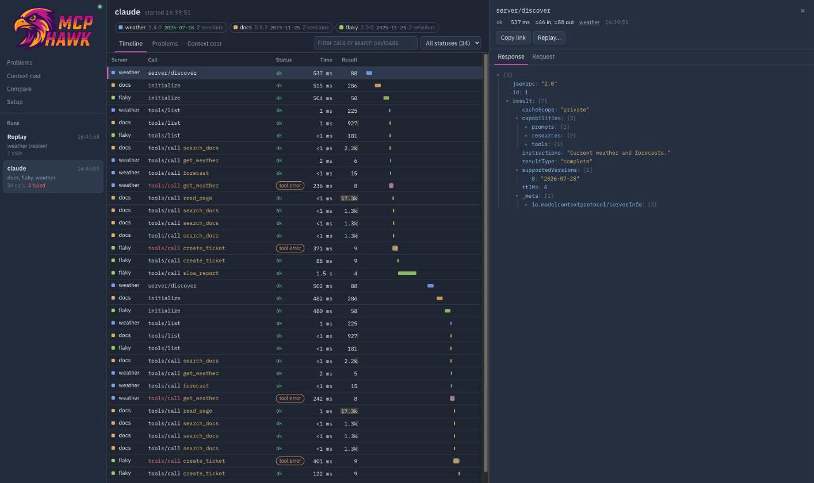

<div align="center">
  

  [](https://github.com/tech4242/mcphawk/actions/workflows/ci.yml)
  [](https://codecov.io/gh/tech4242/mcphawk)
  [](https://pypi.org/project/mcphawk/)
  [](https://www.python.org/downloads/)
  [](https://modelcontextprotocol.io/specification/2026-07-28)
  [](https://opensource.org/licenses/MIT)
</div>

**MCPHawk is DevTools for the Model Context Protocol.** It records the real traffic
between your MCP clients (Claude Code, Claude Desktop, Cursor, VS Code, your own agent)
and their servers, and shows it the way a browser's network tab would: every call of an
agent run on one timeline, what each server costs in context, and what went wrong.

The same data is available to your agent: add MCPHawk as an MCP server and Claude Code can
find the failing call, read it, fix your server and check again, linking you to exactly
what it looked at.



## Quick start

```bash
pip install mcphawk          # or run everything below with `uvx mcphawk ...`

mcphawk install              # route your clients' MCP servers through MCPHawk (with backups)
                             # ...restart your MCP clients and use them as usual...
mcphawk up --open            # open the UI at http://127.0.0.1:8484
```

Let your agent read the traffic too:

```bash
claude mcp add mcphawk -- mcphawk mcp
```

Undo everything with `mcphawk uninstall`. Want to see it first? `make demo` (or
`python examples/demo/run_demo.py`) drives three real SDK servers so the UI has something
to show.

## Who it is for

**MCP server authors** debugging "works in the Inspector, breaks in Cursor":
see the real client's requests, the exact error on the wire, how long each call took,
and replay a call with edited arguments against your server.

**Agent builders** asking "what is my agent actually doing, and what does it cost?":
one timeline per agent run across all servers, the tokens each server's tool definitions
add to *every* turn, which tools were never used, which results blew up the context, and
where the agent got stuck repeating the same call.

## What you get

| | |
|---|---|
| **Run timeline** | A waterfall of every call across all servers of one client run, with status, latency and result size. Multi round-trip requests (2026-07-28) are grouped as one chain. |
| **Call inspector** | Rendered tool results (text, images, resources), request and response JSON, HTTP headers, and a stable link to share. |
| **Context cost** | Estimated tokens per server and per tool: definitions sent every turn, results added when called, unused tools, heaviest results. |
| **Problems** | JSON-RPC errors, tool errors, calls that never got an answer, slow calls, agent loops (identical calls in a row) and spec violations, most severe first. |
| **Spec lint** | Checks each session against the protocol version it negotiated: `resultType`, `ttlMs`/`cacheScope`, `Mcp-Method`/`Mcp-Name` headers, removed methods, server-initiated requests, stray stdout output and more. |
| **Compare** | What changed between two captures of a server: tools added, removed or changed (with token delta) and per-call behaviour. |
| **Replay** | Re-send any client request, optionally edited, to the same server; the replay is recorded as its own session so you can compare. |
| **MCP server** | Six read-only tools for agents with compact results and deep links into the UI. |

## How traffic is captured

| Mode | Command | Works for | Notes |
|---|---|---|---|
| **Wrap** (stdio) | `mcphawk wrap -- <server command>` | Any stdio server | What `mcphawk install` sets up. Bytes are forwarded before they are recorded, so capture never slows the client down. |
| **Proxy** (HTTP) | `mcphawk install --include-http`, or `mcphawk proxy --target URL` | Streamable HTTP and legacy HTTP+SSE, including HTTPS and remote servers | Runs inside `mcphawk up`. Remote servers that use OAuth are skipped by default: their tokens are bound to the server URL. |
| **Sniff** (passive) | `sudo mcphawk sniff --port 3000` | Plaintext local HTTP or raw TCP | No config change at all, but needs capture privileges and cannot read TLS. |

Sessions are grouped into **runs** by the client process that started the servers, so one
Claude Code session with five servers is one timeline.

### Protocol support

Both protocol generations are first-class:

* **2026-07-28 (stateless):** identity from `_meta`, `server/discover`, multi round-trip
  requests (`input_required` → retry), `subscriptions/listen`, `Mcp-Method`/`Mcp-Name`
  headers, cache hints.
* **2024-11-05 to 2025-11-25:** the `initialize` handshake, `Mcp-Session-Id`, legacy
  HTTP+SSE endpoints, server-initiated sampling, elicitation and roots.

## MCP tools for agents

`mcphawk mcp` (stdio) or `http://127.0.0.1:8484/mcp` while `mcphawk up` runs:

| Tool | Answers |
|---|---|
| `list_sessions` | What was captured recently? |
| `get_session` | Who talked to whom, and how did each call go? |
| `get_exchange` | What exactly was sent and returned? (capped, truncation is marked) |
| `find_problems` | What went wrong, most severe first? |
| `context_cost` | Which servers and tools are eating my context window? |
| `compare_sessions` | What changed since the last version of my server? |

Every result links into the web UI. Replay is deliberately not exposed to agents.

## Privacy and safety

* Everything stays on your machine in `~/.mcphawk/mcphawk.db` (`MCPHAWK_DB` to change).
* Secrets are masked **before** they are stored: auth headers, keys named like
  `token`/`api_key`/`password`, and common token formats (API keys, JWTs, bearer tokens,
  private keys). Use `--no-mask` only if you need raw values, for example to replay a call
  that needs its credentials.
* The UI binds to `127.0.0.1`. State-changing API calls (replay, clearing data) require a
  custom header and a localhost `Host`, so other websites cannot trigger them.
* `mcphawk install` backs up every file it touches to `~/.mcphawk/backups/`, and
  `uninstall` restores entries structurally, keeping edits you made in between.

## How it compares

| | MCPHawk | [mcpsnoop](https://github.com/kerlenton/mcpsnoop) | [MCP Inspector](https://github.com/modelcontextprotocol/inspector) | [MCP Shark](https://github.com/mcp-shark/mcp-shark) |
|---|:-:|:-:|:-:|:-:|
| Real client traffic (Claude, Cursor, …) | ✅ | ✅ | ❌ own client | ✅ |
| One-command setup for all clients | ✅ | ❌ per server | n/a | ✅ |
| Passive capture without config changes | ✅ | ❌ | ❌ | ❌ |
| Web UI | ✅ | ❌ terminal | ✅ | ✅ |
| Cross-server run timeline | ✅ | ❌ | ❌ | ❌ |
| Context cost per tool | ✅ | ❌ | ❌ | ❌ |
| Spec lint per protocol version | ✅ | ✅ | ❌ | ❌ |
| MCP server so agents can query traffic | ✅ | ❌ | ❌ | ❌ |
| Replay | ✅ | ✅ | ✅ | ✅ playground |
| OTLP / HAR export, CI mode | ❌ not yet | ✅ | ❌ | partial |

Use the Inspector to poke at a server interactively; use MCPHawk to see what really happens
when your agent uses it.

## CLI

```
mcphawk up          Web UI, API, proxy and /mcp on one port (default command)
mcphawk install     Route client configs through MCPHawk   (--include-http, --dry-run, --client)
mcphawk uninstall   Restore the original configs
mcphawk status      Where data lives, what was captured, which servers are routed
mcphawk wrap        Record one stdio server:  mcphawk wrap --name fs -- npx -y @mcp/fs ~/
mcphawk proxy       Record one HTTP server:   mcphawk proxy --target https://example.com/mcp
mcphawk mcp         MCPHawk's own MCP server (stdio or --transport http)
mcphawk sniff       Passive capture (needs sudo)
mcphawk clear       Delete captured traffic
```

## Development

```bash
python3 -m venv .venv && source .venv/bin/activate
make install        # Python deps from requirements-dev.txt + editable install + frontend deps
make dev            # API on :8484 and the Vite dev server with hot reload on :5173
make test           # unit + integration tests (coverage must stay above 85%)
make lint
make build-frontend # the built UI in mcphawk/web/static is committed
```

The architecture in one line: every capture mode feeds a `Recorder` (pairing, chains,
identity, masking) that writes to SQLite; the web API and the MCP server are thin views over
one `Query` layer and the `analysis` modules.

## Upgrading from 0.x

1.0 is a rewrite. The database moved to `~/.mcphawk/` with a new schema (old captures are
not migrated), the Textual/terminal UI is gone, and `mcphawk web` became `mcphawk up`.
Existing `mcphawk wrap <command>` entries in client configs keep working and are recognised
by `install`/`uninstall`. See [CHANGELOG.md](CHANGELOG.md).

## License

MIT
