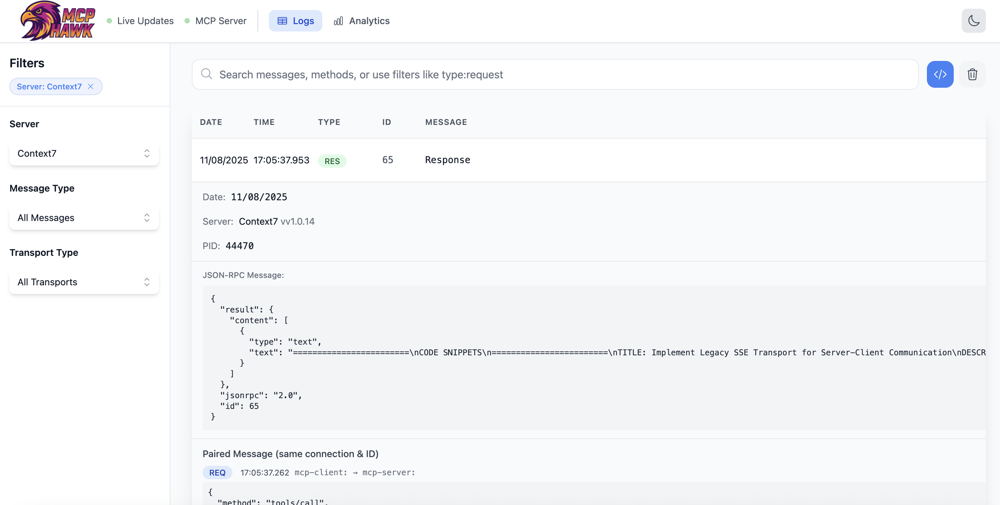

<div align="center">
  
  
  [](https://github.com/tech4242/mcphawk/actions/workflows/ci.yml)
  [](https://codecov.io/gh/tech4242/mcphawk)
  [](https://www.python.org/downloads/)
  [](https://typer.tiangolo.com/)
  [](https://fastapi.tiangolo.com/)
  [](https://vuejs.org/)
  [](https://github.com/astral-sh/ruff)
  [](https://www.python.org/dev/peps/pep-0008/)
  [](https://opensource.org/licenses/MIT)
</div>

MCPHawk is a new Logging & Monitoring solution for **Model Context Protocol (MCP)** traffic, providing deep visibility into MCP client-server interactions. It started off as a mix between Wireshark and mcpinspector, purpose-built for the MCP ecosystem, and is now slowly turning into something more.

**Key Capabilities:**
- **Protocol-Aware Capture**: Understands MCP's JSON-RPC 2.0 transport layer, capturing and reassembling messages from stdio pipes and HTTP streams
- **Transport Agnostic**: Monitors MCP traffic across all standard transports (stdio, HTTP Streaming, HTTP+SSE)
- **Full Message Reconstruction**: Advanced stream reassembly handles fragmented packets, chunked HTTP transfers, SSE streams, and stdio pipes



## Core Features

### 🔍 MCP Protocol Analysis
- **Complete JSON-RPC 2.0 Support**: Correctly identifies and categorizes all MCP message types
  - **Requests**: Method calls with unique IDs for correlation
  - **Responses**: Success results and error responses with matching IDs  
  - **Notifications**: Fire-and-forget method calls without IDs
  - **Batch Operations**: Support for JSON-RPC batch requests/responses
- **Transport-Specific Handling**: See MCP Transport Support table below for full details
  - **Chunked Transfer**: Handles HTTP chunked transfer encoding transparently
- **Protocol Compliance**: Validates JSON-RPC 2.0 structure and MCP-specific extensions

### 🚀 Advanced Capture Capabilities
- **Auto-Discovery Mode**: Intelligently detects MCP traffic on any port using pattern matching
- **TCP Stream Reassembly**: Reconstructs complete messages from fragmented packets
- **Multi-Stream Tracking**: Simultaneously monitors multiple MCP client-server connections
- **IPv4/IPv6 Dual Stack**: Native support for both IP protocols
- **Zero-Copy Architecture**: Efficient packet processing without client/server overhead

### 📊 Analysis & Visualization
- **Real-Time Web Dashboard**: Live traffic visualization with WebSocket updates
- **Message Flow Visualization**: Track request-response pairs using JSON-RPC IDs
- **Traffic Statistics**: Method frequency, error rates, response times
- **Search & Filter**: Query by method name, message type, content patterns
- **Export Capabilities**: Save captured sessions for offline analysis

### 🛠️ Developer Experience
- **MCP Server Integration**: Query captured data using MCP protocol itself
  - FastMCP-based implementation for maximum compatibility
  - Available tools: `query_traffic`, `search_traffic`, `get_stats`, `list_methods`
  - Supports both stdio and HTTP transports
- **Multiple Interfaces**:
  - Web UI for interactive exploration
  - CLI for scripting and automation  
  - MCP server for programmatic access
- **Flexible Deployment**:
  - Standalone sniffer mode
  - Integrated web + sniffer
  - Historical log analysis without active capture

### MCP Transport Support

| Official MCP Transport | Protocol Version | Capture Support | Details |
|------------------------|------------------|:---------------:|---------|
| **stdio** | All versions | ✅ Full | Process wrapper transparently captures stdin/stdout between client and server |
| **HTTP Streaming** | 2025-03-26+ | ✅ Full | HTTP POST with optional SSE streaming responses |
| **HTTP+SSE** (deprecated) | 2024-11-05 | ✅ Full | Legacy transport with separate SSE endpoint |

Note: Raw TCP traffic with JSON-RPC is also captured and marked as "unknown" transport type

## Comparison with Similar Tools

| Feature                                      | MCPHawk | mcpinspector | Wireshark |
|-----------------------------------------------|:---------:|:------------:|:---------:|
| Passive sniffing (no proxy needed)            |     ✅     |      ❌       |     ✅     |
| MCP/JSON-RPC protocol awareness               |     ✅     |      ✅       |     ❌     |
| SSE/Chunked HTTP support                      |     ✅     |      ❓       |     ❌     |
| TCP stream reassembly                         |     ✅     |      ❌       |     ✅     |
| Auto-detect MCP traffic                       |     ✅     |      ❌       |     ❌     |
| Web UI for live/historical traffic            |     ✅     |      ✅       |     ❌     |
| JSON-RPC message type detection               |     ✅     |      ❌       |     ❌     |
| MCP server for data access                    |     ✅     |      ❌       |     ❌     |
| No client/server config needed                |     ✅     |      ❌       |     ✅     |
| Interactive testing/debugging                 |     ❌     |      ✅       |     ❌     |
| Proxy/MITM capabilities                       |     ✅ (stdio)     |      ✅       |     ❌     |

**When to use each tool:**
- **MCPHawk**: Passive monitoring, protocol analysis, debugging MCP implementations, understanding traffic patterns
- **mcpinspector**: Active testing, crafting requests, interactive debugging with proxy
- **Wireshark**: General network analysis, non-MCP protocols, packet-level inspection

## TLS/HTTPS Limitations

MCPHawk captures **unencrypted** MCP traffic only. It cannot decrypt:
- HTTPS/WSS (WebSocket Secure) connections
- TLS-encrypted TCP connections
- Any SSL/TLS encrypted traffic

**This tool is ideal for:**
- 🛠️ **Local MCP development** - Debug your MCP server implementations
- 🔍 **Understanding MCP protocol** - See actual JSON-RPC message flow
- 🐛 **Troubleshooting local tools** - Monitor Claude Desktop, Cline, etc. with YOUR local MCP servers
- 📊 **Development/staging environments** - Where TLS is often disabled

## Installation

### For Users

```bash
# Install from PyPI
pip install mcphawk

# Or install directly from GitHub
pip install git+https://github.com/tech4242/mcphawk.git
```

### Requirements

- **macOS/Linux**: Requires `sudo` for packet capture (standard for network sniffers)
- **Python**: 3.9 or higher
- **Permissions**: Must run with elevated privileges to access network interfaces

### Quick Start

```bash
# Get help
mcphawk --help

# Get help for specific command
mcphawk sniff --help
mcphawk web --help

# Start web UI with auto-detect mode (requires sudo on macOS)
sudo mcphawk web --auto-detect

# Monitor MCP traffic on a specific port (console output)
sudo mcphawk sniff --port 3000

# Monitor multiple ports with a custom filter
sudo mcphawk sniff --filter "tcp port 3000 or tcp port 8080"

# Auto-detect MCP traffic on any port
sudo mcphawk sniff --auto-detect

# Start web UI with sniffer on specific port
sudo mcphawk web --port 3000

# Start web UI with custom filter for multiple ports
sudo mcphawk web --filter "tcp port 3000 or tcp port 8080"

# View historical logs only (no active sniffing)
sudo mcphawk web --no-sniffer

# Custom web server configuration
sudo mcphawk web --port 3000 --host 0.0.0.0 --web-port 9000

# Enable debug output for troubleshooting
sudo mcphawk sniff --port 3000 --debug
sudo mcphawk web --port 3000 --debug

# Wrap an MCP server to capture stdio traffic
mcphawk wrap /path/to/mcp-server --arg1 --arg2

# Example: Wrap Context7 MCP server to monitor Claude Desktop's documentation lookups
mcphawk wrap npx -y @upstash/context7-mcp@latest

# Claude Desktop config to use the wrapped version:
# {
#   "mcpServers": {
#     "context7": {
#       "command": "mcphawk",
#       "args": ["wrap", "npx", "-y", "@upstash/context7-mcp@latest"]
#     }
#   }
# }

# Start MCP server with Streamable HTTP transport (default)
mcphawk mcp --transport http --mcp-port 8765

# Start MCP server with stdio transport (for Claude Desktop integration)
mcphawk mcp --transport stdio

# Start sniffer with integrated MCP server (HTTP transport)
sudo mcphawk sniff --port 3000 --with-mcp --mcp-transport http

# Start web UI with integrated MCP server
sudo mcphawk web --port 3000 --with-mcp --mcp-transport http --mcp-port 8765
```

## MCP Server Integration

MCPHawk includes a built-in MCP server, allowing you to query captured traffic through the Model Context Protocol itself. This creates powerful possibilities:

- **AI-Powered Analysis**: Connect Claude or other LLMs to analyze traffic patterns
- **Automated Monitoring**: Build agents that detect anomalies or specific behaviors
- **Integration Testing**: Programmatically verify MCP interactions in CI/CD pipelines


### Available Tools

The MCP server exposes these tools for traffic analysis:

| Tool | Description | Parameters |
|------|-------------|------------|
| `query_traffic` | Fetch captured logs with pagination | `limit`, `offset` |
| `get_log` | Retrieve specific log entry | `log_id` |
| `search_traffic` | Search logs by content or type | `search_term`, `message_type`, `traffic_type`, `limit` |
| `get_stats` | Get traffic statistics | None |
| `list_methods` | List unique JSON-RPC methods | None |

### Transport Options

#### HTTP Transport (Development & Testing)

The HTTP transport uses Server-Sent Events (SSE) for streaming responses:

```bash
# Start MCP server
mcphawk mcp --transport http --mcp-port 8765

# Initialize session (note: returns SSE stream)
curl -N -X POST http://localhost:8765/mcp \
  -H 'Accept: text/event-stream' \
  -d '{"jsonrpc":"2.0","method":"initialize","params":{"protocolVersion":"2024-11-05","capabilities":{},"clientInfo":{"name":"test","version":"1.0"}},"id":1}'

# Example response (SSE format):
# event: message
# data: {"jsonrpc":"2.0","id":1,"result":{"protocolVersion":"2024-11-05",...}}
```

#### stdio Transport (Production & Claude Desktop)

For Claude Desktop integration:

```json
{
  "mcpServers": {
    "mcphawk": {
      "command": "mcphawk",
      "args": ["mcp", "--transport", "stdio"]
    }
  }
}
```

The stdio transport follows the standard MCP communication pattern:
1. Client sends `initialize` request
2. Server responds with capabilities
3. Client sends `initialized` notification
4. Normal tool calls can proceed

See [examples/mcp_sdk_client.py](examples/mcp_sdk_client.py) for HTTP client example or [examples/stdio_client.py](examples/stdio_client.py) for stdio communication.

## Platform Support

### Tested Platforms
- ✅ **macOS** (Apple Silicon & Intel) - Fully tested
- ✅ **Linux** (Ubuntu, Debian) - Fully tested  
- ⚠️  **Windows** - Experimental (Scapy should work but untested)

### Known Limitations

- Requires elevated privileges (`sudo`) on macOS/Linux for packet capture
- Limited to localhost/loopback interface monitoring
- Cannot decrypt TLS/HTTPS traffic (WSS, HTTPS)
- IPv6 support requires explicit interface configuration on some systems
- High traffic volumes (>1000 msgs/sec) may impact performance

### Troubleshooting

**Permission Denied Error:**
```bash
# On macOS/Linux, use sudo:
sudo mcphawk web --auto-detect
```

**No Traffic Captured:**
- Ensure the MCP server/client is using localhost (127.0.0.1 or ::1)
- Check if traffic is on the expected port
- Try auto-detect mode to find MCP traffic: `--auto-detect`
- Verify traffic is unencrypted (not HTTPS/TLS)
- On macOS, ensure Terminal has permission to capture packets in System Preferences

**SSE/HTTP Responses Not Showing:**
- Confirm the server uses standard SSE format (event: message\ndata: {...}\n\n)
- Check if responses use chunked transfer encoding
- Enable debug mode to see detailed packet analysis: `--debug`

## Potential Upcoming Features

Vote for features by opening a GitHub issue!

- [x] **Auto-detect MCP traffic** - Automatically discover MCP traffic on any port without prior configuration
- [x] **MCP Server Interface** - Expose captured traffic via MCP server for AI agents to query and analyze traffic patterns
- [x] **Stdio capture** - Transparent process wrapper to capture stdin/stdout communication
- [ ] **Protocol Version Detection** - Identify and display MCP protocol version from captured traffic
- [ ] **Smart Search & Filtering** - Search by method name, params, or any JSON field with regex support
- [ ] **Performance Analytics** - Request/response timing, method frequency charts, and latency distribution
- [ ] **Export & Share** - Export sessions as JSON/CSV, generate shareable links, create HAR-like files
- [ ] **Test Generation** - Auto-generate test cases from captured traffic
- [ ] **Error Analysis** - Highlight errors, group similar issues, show error trends
- [ ] **Session Management** - Save/load capture sessions, compare sessions side-by-side
- [ ] **Interactive Replay** - Click any request to re-send it, edit and replay captured messages
- [ ] **Real-time Alerts** - Alert on specific methods or error patterns with webhook support
- [ ] **Visualization** - Sequence diagrams, resource heat maps, method dependency graphs

... and a few more off the deep end:
- [ ] **TLS/HTTPS Support (MITM Proxy Mode)** - Optional man-in-the-middle proxy with certificate installation for encrypted traffic
- [ ] **External Decryption Integration** - Import decrypted streams from Wireshark, Chrome DevTools, or SSLKEYLOGFILE

## For Developers

```bash
# Set up Python environment
python3 -m venv .venv
source .venv/bin/activate  # On Windows: .venv\Scripts\activate

# Install backend dependencies
pip3 install -r requirements-dev.txt
pip3 install -e .

# Install frontend dependencies and build
cd frontend
npm install
npm run build
cd ..

# Run tests
python3 -m pytest -v
```

### Some Vue options:

```bash
# Option 1: Use make (recommended)
make dev  # Runs both frontend and backend

# Option 2: Run separately
# Terminal 1 - Frontend with hot reload
cd frontend && npm run dev

# Terminal 2 - Backend
mcphawk web --port 3000

# Option 3: Watch mode
cd frontend && npm run build:watch  # Auto-rebuild on changes
mcphawk web --port 3000           # In another terminal
```
